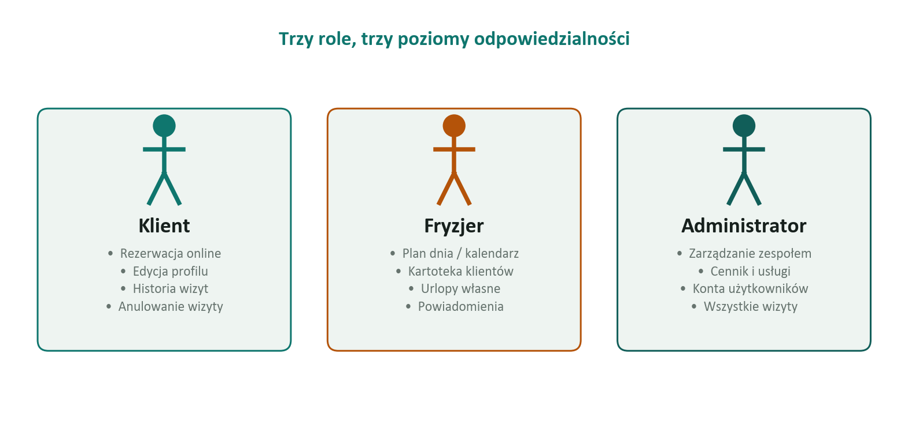
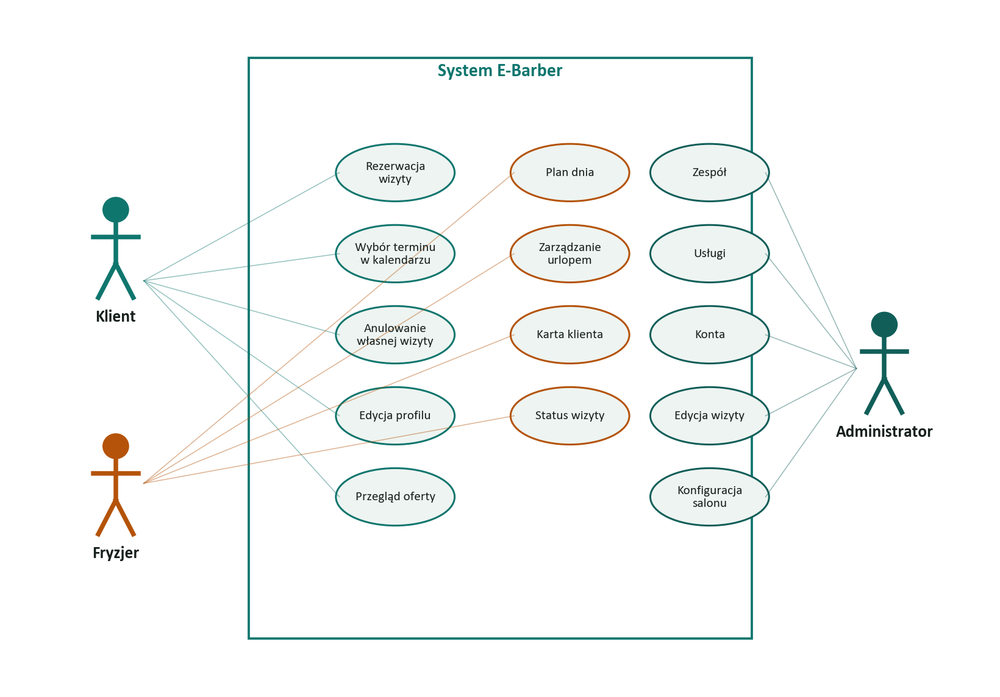
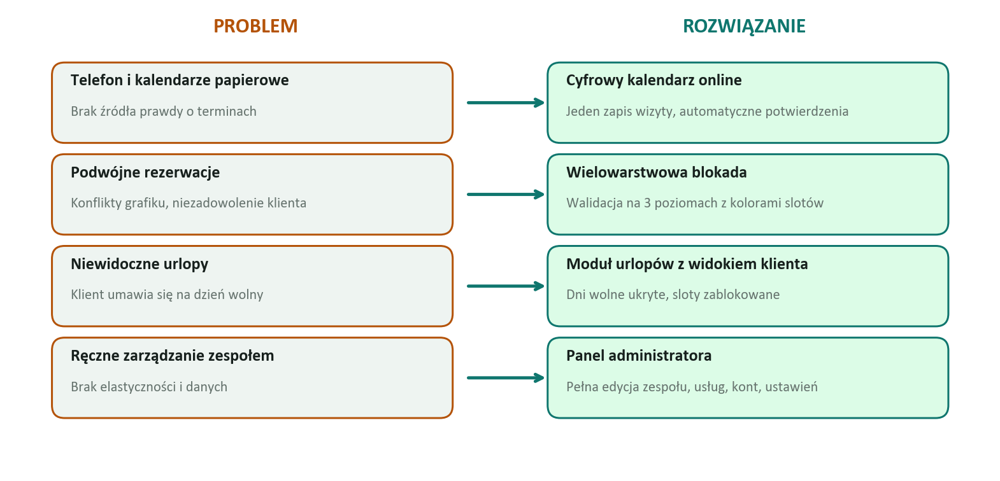
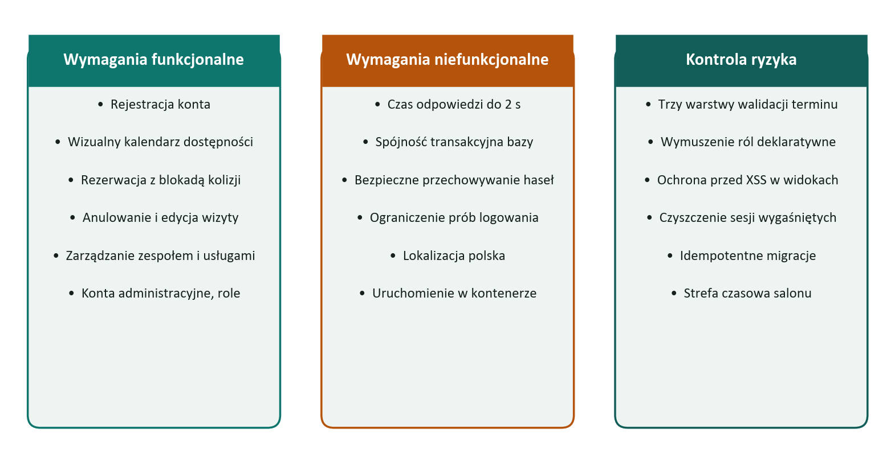
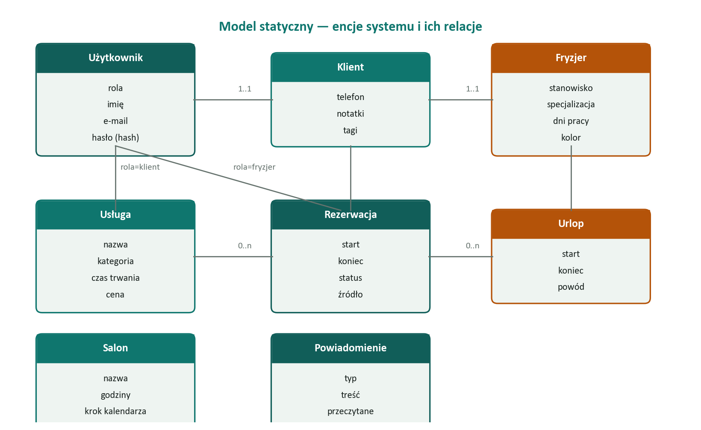
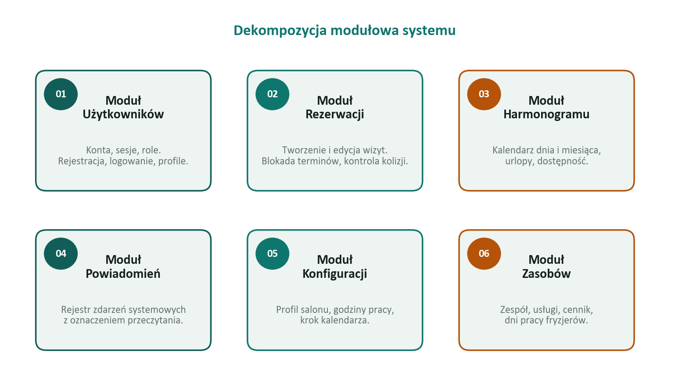
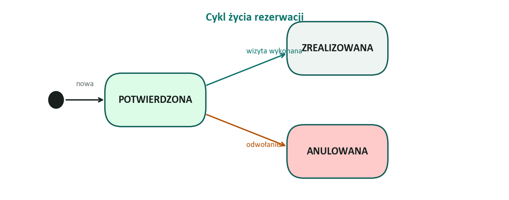
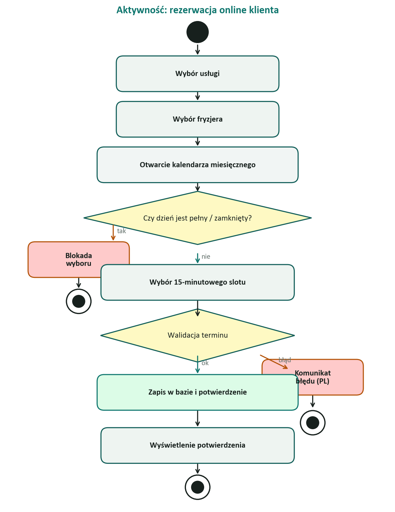
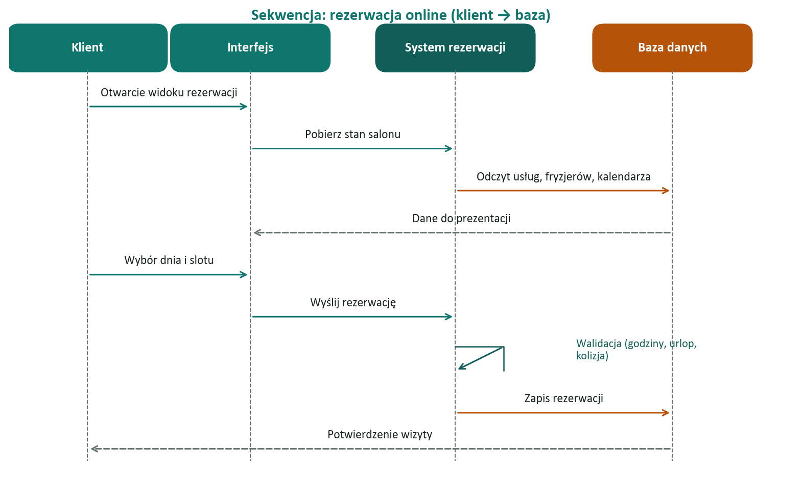

# E-Barber System — Część II

**Identyfikacja aktorów i przypadków użycia, analiza problemu, specyfikacja wymagań, modele statyczny i dynamiczny.**

_Dokumentacja inżynierska — kontynuacja Części I. Nacisk położono na czytelność dla odbiorcy nietechnicznego._

Prezentacja: 30.05.2026

---

## 1. Wprowadzenie

Część I określiła cel projektu i wprowadziła model opisowy. Część II przenosi ten model w wymagania, scenariusze i ilustracje:

- kim są aktorzy systemu i jakie mają cele,
- jakie czynności (przypadki użycia) wykonują,
- jak konkretnie wygląda przebieg rezerwacji,
- jaki problem rozwiązujemy i w jaki sposób,
- jakie są wymagania funkcjonalne, niefunkcjonalne i kontrola ryzyka,
- jak wygląda model statyczny (encje) i dynamiczny (stany, sekwencje, aktywności).

Wszystkie ilustracje na kolejnych stronach pochodzą z modeli zbudowanych na podstawie zaimplementowanego systemu HairBook.

---

## 2. Identyfikacja aktorów

System opiera się na trzech rolach. Każda z nich rozwiązuje inny problem biznesowy salonu.

### 2.1. Aktorzy główni

**Klient** to osoba, która chce szybko umówić się na wizytę bez kontaktu telefonicznego. Korzysta z kalendarza wizualnego z procentem obłożenia każdego dnia, wybiera fryzjera, usługę i konkretny slot godzinowy.

**Fryzjer** zarządza swoim dyżurem. Widzi plan dnia, prowadzi kartoteki swoich klientów (preferencje, uczulenia, notatki) i samodzielnie planuje urlopy bez kontaktowania się z administratorem.

**Administrator** odpowiada za całokształt: zatrudnia i edytuje pracowników, ustala cennik usług, prowadzi konta wszystkich użytkowników i konfiguruje godziny pracy salonu. Posiada pełne uprawnienia we wszystkich modułach.

### 2.2. Aktorzy systemowi

System rezerwacji w tle dba o spójność — automatycznie blokuje nakładające się terminy, oblicza dzienne obłożenie i odrzuca rezerwacje w godzinach poza pracą salonu lub w czasie urlopu pracownika.

Magazyn powiadomień rejestruje istotne zdarzenia (np. nową rezerwację online, zarejestrowanie konta klienta) i wystawia je obsłudze salonu w panelu nieprzeczytanych.

### 2.3. Hierarchia uprawnień

Administrator ma pełnię praw, fryzjer ograniczony zakres pracownika, klient — wyłącznie operacje na własnym koncie. Hierarchia ta jest egzekwowana w każdym punkcie systemu, zarówno w interfejsie (klient nie widzi paneli administracyjnych), jak i na poziomie bazy danych.

---

## 3. Katalog przypadków użycia

Ilustracja niżej grupuje 18 przypadków użycia wokół trzech aktorów głównych. Dla czytelności pominięto interakcje z aktorami systemowymi — te wykonywane są automatycznie.

### 3.1. Przypadki użycia klienta

Klient odpowiada za rezerwację online i obsługę własnego konta. Łącznie pięć interakcji: założenie konta, wybór terminu w kalendarzu wizualnym, rezerwacja wizyty, anulowanie własnej wizyty oraz aktualizacja danych profilowych (w tym hasło i e-mail).

### 3.2. Przypadki użycia fryzjera

Fryzjer obsługuje cztery główne procesy: codzienny plan dnia, zarządzanie kartoteką swoich klientów, samodzielne zgłaszanie urlopów i zmianę statusu wizyty (zrealizowana, anulowana). Każdy fryzjer ma dostęp wyłącznie do własnych urlopów i nie może modyfikować zapisów kolegów z zespołu.

### 3.3. Przypadki użycia administratora

Administrator dysponuje pełnym zakresem: zarządza zespołem (dodawanie, edycja, dni pracy, kolory w kalendarzu), katalogiem usług (czas trwania, cena, opis), kontami użytkowników (dowolna rola, reset hasła), wszystkimi rezerwacjami (pełna edycja) oraz konfiguracją salonu (godziny pracy, krok kalendarza).

---

## 4. Wybrane scenariusze działania

Z 18 przypadków użycia szczegółowo opisano sześć — reprezentatywnych dla każdej roli. Pełen diagram aktywności znajduje się w sekcji 8.

### 4.1. Rezerwacja online klienta

Najczęstszy scenariusz w systemie. Klient wybiera usługę, fryzjera i datę. Kalendarz miesięczny pokazuje procentowe obłożenie każdego dnia (zielone wolne, żółte średnie, pomarańczowe wysokie, czerwone pełne). Po wyborze dnia pojawia się siatka 15-minutowych slotów oznaczonych kolorami dostępności. Klient zatwierdza wybór i otrzymuje potwierdzenie wizyty.

### 4.2. Anulowanie własnej wizyty

Klient w zakładce „Moje wizyty" widzi historię rezerwacji. Wizyty przyszłe ze statusem „potwierdzona" mają przycisk anulowania. System weryfikuje własność wizyty, zmienia status na „anulowana" i zwalnia termin w kalendarzu.

### 4.3. Zgłoszenie urlopu przez fryzjera

Fryzjer w zakładce „Urlopy" dodaje nowe okno nieobecności (początek i koniec, opcjonalnie powód). System natychmiast blokuje rezerwacje na ten przedział i ukrywa wolne sloty u tego fryzjera. Fryzjer nie może dodać urlopu koledze z zespołu.

### 4.4. Oznaczenie wizyty jako zrealizowanej

Fryzjer w planie dnia oznacza obsłużoną wizytę znacznikiem „✓". Status przechodzi na „zrealizowana", wizyta trafia do historii salonu i jest wliczana do statystyk, a slot pozostaje zajęty.

### 4.5. Utworzenie nowego konta przez administratora

Administrator tworzy konto dowolnej roli (klient, fryzjer, administrator). System automatycznie zakłada powiązany rekord — kartotekę klienta lub stanowisko fryzjera z domyślnym grafikiem. Nowy użytkownik może od razu się zalogować.

### 4.6. Edycja rezerwacji przez administratora

Administrator z listy rezerwacji edytuje dowolną wizytę (klient, fryzjer, usługa, termin, status, notatka). System sprawdza dostępność nowego terminu i odrzuca kolizje. Ścieżka używana m.in. przy zmianach telefonicznych.

---

## 5. Analiza problemu

Salon barberski przed wdrożeniem systemu opierał się na telefonie i papierowym terminarzu. Powodowało to konkretne trudności operacyjne — i każda z nich znalazła odpowiedź w architekturze E-Barber.

Cyfrowy kalendarz online stanowi pojedyncze źródło prawdy o terminach. Wielowarstwowa kontrola kolizji (najpierw w widoku slotów, potem w logice aplikacji, na końcu w samej bazie danych) eliminuje podwójne rezerwacje. Widoczność urlopów w widoku klienta likwiduje próby umawiania się na dni wolne pracowników. Panel administratora pozwala salonowi samodzielnie modyfikować ofertę i zespół bez konsultacji z dostawcą oprogramowania.

---

## 6. Specyfikacja wymagań

Wymagania zostały podzielone na trzy obszary: funkcjonalne (co system robi), niefunkcjonalne (jak system działa) i kontrola ryzyka (czego system pilnuje).

### 6.1. Wymagania funkcjonalne

System pozwala zarejestrować konto klienta z weryfikacją danych, uwierzytelnia użytkowników, wyświetla kalendarz z procentowym obłożeniem, blokuje rezerwacje w godzinach poza pracą salonu, w przeszłości i w czasie urlopów fryzjerów. Sloty rezerwacji są podzielone na 15-minutowe okna o czterech kolorach informujących o dostępności. Klient może anulować wyłącznie własną wizytę. Administrator zarządza zespołem, usługami i kontami użytkowników. Edycja rezerwacji jest pełna i ponownie waliduje dostępność nowego terminu.

### 6.2. Wymagania niefunkcjonalne

System odpowiada poniżej 2 sekund przy typowym obciążeniu salonu (do ~100 wizyt dziennie). Spójność transakcyjna jest zapewniona przez bazę PostgreSQL. Hasła użytkowników są przechowywane w postaci skrótu wraz z indywidualną solą — system w żadnym miejscu nie ma dostępu do hasła w postaci jawnej. Próby logowania są ograniczone do 10 na minutę z jednego adresu IP. Cała aplikacja jest gotowa do uruchomienia w jednym poleceniu kontenera Docker, a interfejs i komunikaty są zlokalizowane w języku polskim.

### 6.3. Kontrola ryzyka

Trzy najważniejsze rodzaje ryzyka zostały zaadresowane wielowarstwowo. Po pierwsze: niemożliwość podwójnej rezerwacji egzekwowana jest w interfejsie, w logice aplikacji oraz w bazie danych jednocześnie. Po drugie: role i uprawnienia są deklaratywne — każda akcja jest poprzedzana sprawdzeniem, czy aktualny użytkownik faktycznie ma uprawnienie do tej operacji. Po trzecie: cały system działa w jednej strefie czasowej (Europa/Warszawa), co eliminuje błędy przesunięć godzinowych między klientem a serwerem.

### 6.4. Weryfikacja wymagań

Każde z wymagań ma przypisaną metodę weryfikacji. Funkcjonalności są pokryte automatycznymi testami jednostkowymi (logika rezerwacji, kalkulacja obłożenia, autoryzacja). Wymagania niefunkcjonalne są weryfikowane przeglądem konfiguracji i scenariuszami testowymi. Ryzyka są monitorowane przez ograniczenia w schemacie bazy danych — niezależnie od błędu w warstwie aplikacji.

---

## 7. Model statyczny

Model statyczny opisuje encje (rzeczowniki systemu) i ich wzajemne relacje. Każda encja ma jasny zakres odpowiedzialności i ograniczony zestaw atrybutów.

Konto użytkownika jest wspólnym elementem dla wszystkich ról. W zależności od roli powiązane jest z dodatkowym rekordem: kartą klienta (telefon, notatki, tagi) lub stanowiskiem fryzjera (specjalizacja, kolor, dni pracy). Rezerwacja łączy w sobie klienta, fryzjera, usługę i przedział czasowy. Urlop dotyczy konkretnego fryzjera. Salon i powiadomienia są globalnymi obiektami zarządzanymi przez administratora.

### 7.1. Dekompozycja modułowa

Implementacja została podzielona na sześć modułów funkcjonalnych. Każdy moduł ma jasno wyodrębniony zakres i własny model danych.

Moduł użytkowników odpowiada za rejestrację, logowanie i edycję profilu. Moduł rezerwacji za tworzenie wizyt i kontrolę kolizji. Moduł harmonogramu za kalendarz miesięczny, dzienny i urlopy. Moduł powiadomień za rejestr zdarzeń. Moduł konfiguracji za profil salonu. Moduł zasobów za zespół i katalog usług.

---

## 8. Model dynamiczny

Model dynamiczny pokazuje jak system reaguje na zdarzenia i jak zmieniają się stany jego obiektów w czasie.

### 8.1. Cykl życia rezerwacji

Każda rezerwacja przechodzi przez krótki cykl życia z trzema stanami końcowymi.

Każda nowa rezerwacja powstaje w stanie „potwierdzona" — w systemie nie ma stanu pośredniego typu „oczekuje na akceptację". Z tego stanu możliwe są dwa przejścia: do „zrealizowana" po obsłużeniu klienta lub do „anulowana" w przypadku odwołania. Stany końcowe są nieodwracalne — nie można cofnąć anulowania ani zmienić zrealizowanej wizyty z powrotem na potwierdzoną.

### 8.2. Diagram aktywności — rezerwacja online

Pełny przebieg najważniejszego scenariusza systemu — rezerwacji klienta online. Diagram pokazuje wszystkie punkty decyzyjne i alternatywne zakończenia procesu.

Aktywność rozpoczyna się od wyboru usługi i fryzjera. Kalendarz miesięczny prezentuje dostępność. Jeżeli klient próbuje wybrać dzień pełny lub zamknięty — system blokuje wybór już na poziomie interfejsu. Po wyborze 15-minutowego slotu następuje walidacja terminu po stronie serwera (godziny pracy, urlopy, kolizje). Sukces kończy się zapisem w bazie i potwierdzeniem; błąd — komunikatem w języku polskim.

### 8.3. Diagram sekwencji — rezerwacja online

Ten sam scenariusz w ujęciu interakcji między komponentami systemu. Pokazuje przepływ komunikatów między klientem, interfejsem, logiką serwera a bazą danych.

Klient inicjuje interakcję z interfejsem. Interfejs pobiera aktualny stan salonu (zespół, usługi, kalendarz). Klient dokonuje wyboru, interfejs wysyła rezerwację do logiki serwera. Serwer wykonuje walidację (jeden krok obejmujący godziny pracy, urlopy i kolizje), zapisuje wizytę w bazie i potwierdza sukces. Klient otrzymuje informację o zarezerwowaniu terminu.

---

## 9. Analiza modeli interakcji

System wyróżnia trzy poziomy interakcji o różnym charakterze.

Interakcja klient–system jest synchroniczna i prosta: każde działanie klienta (wybór, zatwierdzenie) wyzwala jednorazowy przepływ kończący się odpowiedzią systemu. Klient zawsze wie, czy jego wizyta została zarezerwowana.

Interakcja pracownik–system łączy synchroniczne odczyty (plan dnia, kalendarz) z asynchronicznymi powiadomieniami. Fryzjer może w dowolnej chwili sprawdzić ile nowych zdarzeń pojawiło się od czasu jego ostatniej wizyty w systemie.

Interakcja administracyjna jest najszersza — administrator dysponuje pełnym CRUD-em (utworzenie, odczyt, aktualizacja, usunięcie) na wszystkich zasobach systemu. Każde działanie administratora propaguje się natychmiast do widoków pozostałych aktorów.

---

## 10. Podsumowanie

Część II projektu E-Barber zrealizowała pełne przejście od modelu opisowego do specyfikacji wymagań i scenariuszy działania.

Zidentyfikowano trzy role aktorów głównych i dwóch aktorów systemowych. Wyodrębniono 18 przypadków użycia, z czego sześć przedstawiono szczegółowo wraz z diagramami aktywności. Opisano problem biznesowy (papierowy terminarz, brak źródła prawdy o terminach) i odpowiadające rozwiązania (cyfrowy kalendarz, wielowarstwowa kontrola kolizji, widoczne urlopy, panel administracyjny). Sformułowano wymagania funkcjonalne, niefunkcjonalne i kontrolę ryzyka z metodami ich weryfikacji. Zbudowano model statyczny (encje i relacje) oraz dynamiczny (cykl życia rezerwacji, diagram aktywności, diagram sekwencji).

Implementacja referencyjna systemu HairBook potwierdza, że wszystkie zdefiniowane wymagania są możliwe do realizacji w jednej spójnej aplikacji.

---

_Dokumentacja przygotowana na zajęcia 30.05.2026._
